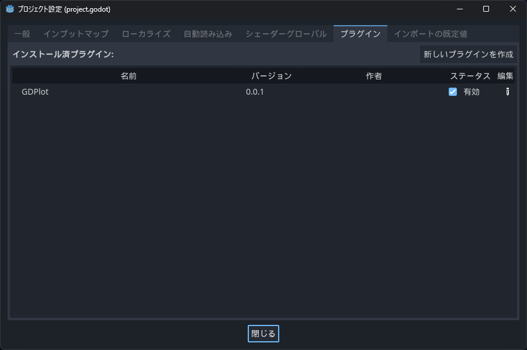
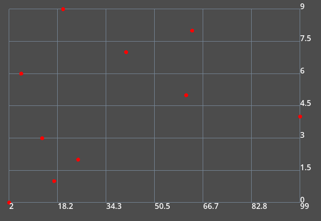
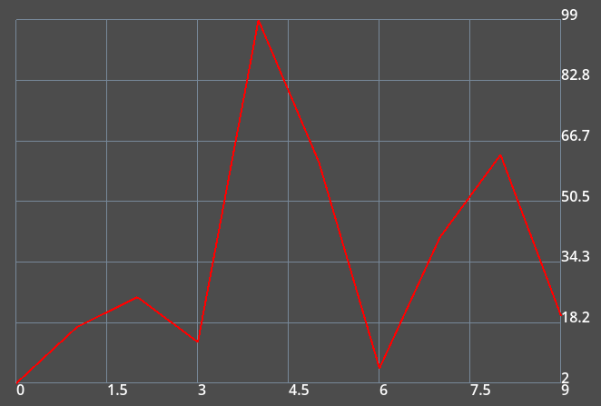
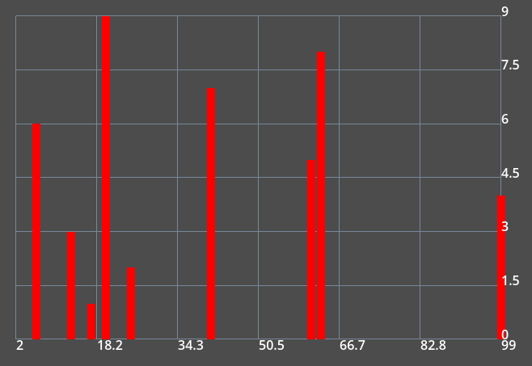

## 1. 概要

- GDPlot は、2D グラフを描画するノードを追加する Godot Plugin です
- Godot Ver.4.X.X に対応しています
- 以下のグラフに対応しています
  - Scatter Plot
  - Line Graph
  - Bar Graph

## 2. インストール

1. プロジェクトフォルダの直下に addons フォルダが存在しない場合は作成します
2. addons フォルダの直下にリポジトリをクローンします

```bash
$ mkdir addons
$ cd addons
$ git clone https://github.com/l7u7ch/GDPlot
```

3. プラグインを有効にします



## 3. 使い方

### 3.1. Scatter Plot を描画する

```C#
GDPlot GDPlot = new()
{
    Size = new Vector2(600, 400),
    Position = new Vector2(50, 50)
};
Scatter Scatter = GDPlot.Plot.CreateScatter();
Scatter.X = new() { 2, 17, 25, 13, 99, 61, 6, 41, 63, 20 };
Scatter.Y = new() { 0, 1, 2, 3, 4, 5, 6, 7, 8, 9 };
Scatter.MarkerColor = Colors.Red;
AddChild(GDPlot);
```



### 3.2. Line Graph を描画する

```C#
GDPlot GDPlot = new()
{
    Size = new Vector2(600, 400),
    Position = new Vector2(50, 50)
};
Line Line = GDPlot.Plot.CreateLine();
Line.X = new() { 2, 17, 25, 13, 99, 61, 6, 41, 63, 20 };
Line.Y = new() { 0, 1, 2, 3, 4, 5, 6, 7, 8, 9 };
Line.LineColor = Colors.Red;
AddChild(GDPlot);
```



### 3.3. Bar Graph を描画する

```C#
GDPlot GDPlot = new()
{
    Size = new Vector2(600, 400),
    Position = new Vector2(50, 50)
};
Bar Bar = GDPlot.Plot.CreateBar();
Bar.X = new() { 2, 17, 25, 13, 99, 61, 6, 41, 63, 20 };
Bar.Y = new() { 0, 1, 2, 3, 4, 5, 6, 7, 8, 9 };
Bar.BarColor = Colors.Red;
AddChild(GDPlot);
```


